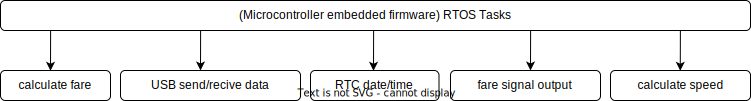

# IOTISTIC-TAXI-METER
## Context

### Objective
build embedded firmware for taxi-meter devices that meet OIML standards R-21.

### Background
After the widespread of electronic systems for calculating fares in TAXI public transportation, there has become an urgent need to establish accurate standards for measuring the costs of trips and fares from passengers. Hence the a need for OIML standards through which transportation fees are determined accurately based on several data and methods that ensure this.

## Design
### Overview
embedded firmware for the taxi-meter device will measure & calculate a lot of parameters related to taxi trips like fare, distance & time in a very accurate manner to meet OIML R-21 standards & requirements.

### Functional Requirements
+ **Embedded firmware will measure these parameters**:
  - Trip time in seconds based on time measuring signal with high accuracy & maximum permissible error (MPE) that meets OIML R-21 standards.
  - Trip distance in meters based on distance measuring signal with high accuracy & maximum permissible error (MPE) that meets OIML R-21 standards depending on car K-Constant.
> [!NOTE]
  > MPE for trip time is (0.2s or 0.002 from the trip time) which is greater.
  > MPE for trip time is (4 meters or 0.001 from the trip distance) which is greater.
+ **Embedded firmware will calculate the fare depending on**:
  - Measured trip time in seconds.
  - Measured trip distance in meters.
  - Calculation methods are single or double.
  - Car speed in KM/H
  - Day/Night initial trip distance
  - Day/Night initial trip time
  - Day/Night Time/Distance tariff & cross-over speed.
  - Day/Night initial fee.
  - Fare steps based on minimum currency unit in our case 0.01 Cu.
> [!NOTE]
  > **Single application of tariff**:Fare calculation based on the application of the time tariff below the cross-over speed and application of the distance tariff above the cross-over speed.
  > 
  > **Double application of tariff**: Fare calculation based on the combined application of time tariff and distance tariff over the whole journey.
  >
  > **Taximeter constant k**: Constant expressed in pulses per kilometer which represents the number of pulses the taximeter must receive to correctly indicate a distance traveled of one kilometer.
  >
  > **Initial distance**: Distance which can be traveled according to the tariff for the initial hire fee, considering distance-counting only.
  >
  > **Initial time**: The period during which the taxi can be used for the initial hire fee, considering time-counting only.

+ **Embedded firmware will be able to generate fare pulses synchronized with fare result**:
  - fare pulses will generated from the test connector of the taxi meter based on the fare calculation function at a maximum speed of 200KM/H with maximum tariff parameters and calculation methods.
> [!NOTE]
  > At maximum speed 200KM/H, Maximum k-constant 6000 pulse/km in our case, output fare signal frequency up to 333.333Hz so embedded firmware will be able to generate the pulses with frequency       333.33Hz or more.

+ **Embedded firmware will calculate speed to change calculation methods from time-based to distance-based depending on cross-over speed**:
  - The speed calculation task will update the speed every one second with an accuracy of more than 99%.
  - **Cross-over speed**: Speed of the taxi (km/h) at which the time-counting and distance-counting methods operate the taximeter at the same rate. The speed value is determined by division of the time tariff value by the applicable distance tariff value.
> [!NOTE]
  > There is no MPE related to speed measuring accuracy because fare at cross-over speed will increase at the same rate if the functions calculate the fare based on distance or based on time & we take confirmation from OIML for this note.

> [!NOTE]
>
> **Distance measuring signal**: Signal supplied by the distance measurement transducer to the taximeter, in proportion to the distance traveled in our case it is VSS (Vehicle speed sensor signal) or from test connector distance-input signal.
>
> **Time measuring signal**:Signal supplied by a clock incorporated in the taximeter, in proportion to the duration of the journey. from (external test connector time-input signal or internal RTC module pulse signal).
>
> **Maximum permissible error, MPE**: Extreme value of an error permitted by specifications, regulations, etc., for a given instrument.in our case, The maximum permissible error for the trip time  is 0.2s or (0.002 x trip time in seconds) which is greater & the maximum permissible error for the trip distance is 4m or (0.001 x trip distance in meters) which is greater.
>
> **Internal RTC Real-time clock**: The real-time clock shall keep track of the time of the day and the date. One or both values may be used for the automatic change of tariff in our case we use the DS3231D module in the range of -40°C to +85°C, and the accuracy remains at ±3.5ppm (±0.3024 seconds/day), we use INT/SQW pin from RTC as a time measuring signal on 1.024Khz base.

### Interfaces
**Embedded firmware will be able to send/receive data & configuration commands through UART-USB serial protocol via COM PORT to peripherals at this capacity:**:
  -  close to 50 Hz data rate, 50 packets/seconds at a baud rate of 0.460800 MB/second.
> [!NOTE]
  > Based on the previous parameters, the peripherals must be able to do all fare calculations that meet OIML standards with no problems, but in our case, we decided to build all functions related to    fare calculations inside embedded firmware to reduce the possibility of errors that related user application limitations.

### Data model
+ **Taxi meter embedded firmware data**:
+ + Time stamp include date & time.
  + Total distance traveled in meters from ignition on.
  + Uptime (Total time measured from ignition on).
  + Trip time in seconds.
  + Trip distance in meters.
  + Speed in KM/H.
  + cross-over speed.
  + single time (sum of time segments in seconds when fare calculation method is time-based in single mode when speed is lower than cross-over speed).
  + single distance (sum of distance segments in meters when fare calculation method is distance-based in single mode when speed is above cross-over speed).
  + fare counting rules (time-based (single), distance-based (single), (time & distance)-based).
  + active calculation modes (day or night).
    + 
+ stored configuration parameters:
+ + taxi k-constant.
    + day initial fee.
    + night initial fee.
    + day initial distance.
    + night initial distance.
    + day initial time.
    + night initial time.
    + day distance tariff.
    + night distance tariff.
    + day time tariff.
    + night time tariff.
    + fare counting mode(single/double).

> [!WARNING]
> If you need to add initial distance or initial time you need to add both, because based on the requirements confirmed by team members the calculation must start when
> trip time reaches initial time or when trip distance reaches initial distance which is faster to reach, we will discuss with OIML about this if there are any notes from their side & make necessary changes.

Taxi meter settings:

+ taxi k-constant.
+ day initial fee.
+ night initial fee.
+ day initial distance.
+ night initial distance.
+ day initial time.
+ night initial time.
+ day distance tariff.
+ night distance tariff.
+ day time tariff.
+ night time tariff.

> [!NOTE]
**Initial hire fee (or initial charge)**: First increment of fare indication upon activation of the taximeter.
>
> **Fare increment step**:Smallest amount of money by which the fare may be incremented in equal steps in the "Hired" (Occupied) operating position by the national regulations. (in our case we choose a constant fare step equal to 0.01 Cu.
>
> **Time tariff value**: Tariff value expressed as an amount of money for a given period of time. (in our case amount of money charged per hour).
>
> **Distance tariff value**: Tariff value expressed as an amount of money for a given distance. (in our case amount of money charged per Km).
> 
<h1><strong>Microcontroller RTOS Diagram</strong></h1>

+ **calculate fare task**:
this main task will do other sub-tasks:
  + Count total trip distance signal pulses & calculate the distance in km depending on the taxi k-constant in all running modes (single/double/day/night).
  + Count total trip time signal pulses & calculate the time in seconds based on RTC clock output frequency (in our case 1024 pulse/second) in all running modes (single/double/day/night).
  + Count trip distance signal pulses & calculate the distance in km depending on the taxi k-constant while the taxi speed is more than the cross-over speed. (let's name it a single distance).
  + Count trip time signal pulses & calculate the time in seconds depending on RTC clock-out frequency while taxi speed is less than or equal to cross-over speed. (let's name it a single time).
  + Calculate fare depending on taxi meter running mode (single/double/day/night) & related parameters of tariffs & cross-over speed.
  + 

